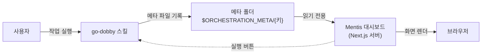
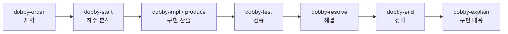

# Mentis Dashboard — 소개 (ABOUT)

> `go-dobby`(여러 에이전트로 이슈·작업을 자동 처리하는 오케스트레이션 플러그인)의 진행 상황을 눈으로 보기 위한 로컬 대시보드입니다.
> 코드를 모르는 사람도 이해할 수 있게 정리했습니다. (기준일: 2026-08-10)

## 목차

1. [만들게 된 동기](#1-만들게-된-동기)
2. [아키텍처](#2-아키텍처)
3. [동작 원리와 대표 기능](#3-동작-원리와-대표-기능)
4. [주요 스킬](#4-주요-스킬)
5. [페이지](#5-페이지)
6. [장점과 단점](#6-장점과-단점)
7. [성능 최적화](#7-성능-최적화)
8. [용어 사전](#용어-사전)

> 낯선 낱말(오더·메타·세션·워크트리·팬아웃 등)은 맨 아래 [용어 사전](#용어-사전)에 모아 두었습니다.

---

## 1. 만들게 된 동기

한마디로, **지난 작업을 다시 찾기 어렵고, 여러 에이전트가 지금 뭘 하는지 한눈에 안 보여서** 만들었습니다.

- **지난 작업 찾기가 번거로움** — 작업이 쌓이면 옛 세션을 하나씩 열어 읽어야 "그게 뭐였는지" 알 수 있었다.
- **에이전트 상태가 안 보임** — 여러 에이전트가 동시에 도는데, 누가 어느 단계(분석·구현·리뷰·완료)인지 로그로는 한눈에 안 보였다.
- **예전 방식** — 터미널 탭마다 이름을 적고 오가며 로그를 읽어 확인했다. 손이 많이 갔다.
- **개인용** — 팀 배포가 아니라 내가 쓰려고 만든 로컬 도구다.
- **재미** — 에이전트들의 "소감"이 궁금했고, 반복 작업을 조금 재미있게 하려고 아바타·소감을 넣었다.

---

## 2. 아키텍처

핵심은 하나입니다 — **스킬은 파일을 쓰고, 대시보드는 그 파일을 읽는다.**

- **기술 스택** — Next.js 14 · React 18 · TypeScript · Ant Design v6 · react-markdown.
- **저장소 없음** — 데이터베이스·외부 API 없이, 메타 파일을 서버가 직접 읽어 보여준다.
- **단방향** — 스킬이 쓰고 대시보드는 읽기만 한다(소감 캐시·해결 버튼·백업만 예외).
- **실행은 별도 경로** — 실행 버튼은 서버 API(`/api/orders`)가 헤드리스 claude를 띄워 처리하고 로그를 실시간으로 보낸다.

**핵심 규약** (대시보드가 데이터를 이해하는 규칙)

- **오더 1건 = 폴더 1개** — `$ORCHESTRATION_META/{키}/`. 키는 `FE1-1187` 또는 `TASK-{slug}`.
- **목록에 뜨는 조건** — 그 폴더에 `status.md` 또는 `orchestration.md`가 있으면 오더로 인식한다.
- **상태 정본은 한 곳** — 에이전트 상태는 `orchestration.md` 상태표에서만 관리한다.
- **파싱** — `src/lib`가 마크다운을 정해진 규칙대로 읽어 필요한 값만 뽑는다.

---

## 3. 동작 원리와 대표 기능

작업 한 건은 아래 순서를 거치고, 각 단계가 파일을 남기면 대시보드가 그 파일을 읽어 화면을 그립니다.

- **관제 보드** — 에이전트 칸반(대기·분석·구현·리뷰·완료), 완료율, 정체 감지, 타임라인.
- **코드 변경** — 에이전트별 수정 파일·커밋·변경 전후 차이(diff).
- **콘솔** — 실시간 실행 로그와 지난 세션 기록.
- **구현 내용** — 비개발자용 설명 + 흐름도.
- **이어가기** — `claude --resume` 명령을 복사해 옛 세션으로 복귀(동기 1을 직접 해결).
- **실행 패널** — 대시보드에서 `dobby-order`를 바로 실행.
- **아바타·소감** — 에이전트마다 아바타를 배정하고 상태에 따라 한마디를 남긴다(재미 요소).
- **백업** — Claude 세션 기록 폴더를 증분 압축으로 백업.

---

## 4. 주요 스킬

모든 작업은 `dobby-order` 하나로 시작합니다. 나머지는 그 안에서 불려 쓰이는 부품입니다.

| 스킬 | 하는 일 |
|---|---|
| `dobby-order` | 유일한 진입점. 에이전트 몇 명(팬아웃 K)으로 나눌지 정하고 착수·구현·리뷰·통합을 지휘 |
| `dobby-start` | 에이전트별 착수·분석. 워크트리·브랜치 생성, 분석·테스트 계획 작성 |
| `dobby-impl` | 코드 구현. 계약이 허용한 파일 범위 안에서만 수정 |
| `dobby-produce` | 코드가 아닌 산출물(문서·조사·분석) 작성 |
| `dobby-test` | 실제 브라우저로 동작 검증 |
| `dobby-resolve` | 작업을 "해결" 상태로 표시 |
| `dobby-end` | 끝난 작업의 워크트리 정리 |
| `dobby-explain` | 비개발자용 "구현 내용" 문서 생성 |
| `dobby-retro` | 재작업·불일치 원인을 정리한 회고 |
| `dobby-jira-tab` | Jira 이슈 정리·요약·게시 |
| `dobby-share` | 구현 내용을 공개 아티팩트로 게시 |
| `dobby-qa` | 통합 후 편입 버그를 담당 에이전트가 수정 |
| `dobby-init` | 환경 설정 파일 생성 |
| `avatar-quips` | 아바타 소감 생성(재미 요소) |
| `dobby-migrate` | 옛 v1 메타를 v2 형식으로 변환 |

---

## 5. 페이지

| 경로 | 이름 | 보여주는 것 |
|---|---|---|
| `/` | 홈 | 개발·비개발 지표, 마지막 백업 |
| `/orchestration` | 목록 | 오더 목록 + 실행 패널 + 검색·필터 |
| `/orchestration/[key]` | 관제 보드 | 칸반·완료율·타임라인·요약 |
| `.../changes` | 코드 변경 | 에이전트별 수정 파일·커밋·diff |
| `.../explain` | 구현 내용 | 비개발자용 설명 + 흐름도 |
| `.../verify` | 검증 | 브라우저 검증 결과 + 확인 가이드 |
| `.../jira` | Jira | 이슈 원문·요약(있을 때만) |
| `.../artifact` | 아티팩트 | 공개 링크·로컬 미리보기 |
| `.../retro` | 회고 | 재작업 원인·개선 제안 |
| `/orchestration/console/[key]` | 콘솔 | 실시간 로그 + 세션 기록 |
| `/agents` | 에이전트 소개 | 도비 에이전트 소개 |
| `/avatars` | 아바타 | 그룹별 아바타 |
| `/map` | 구성도 | 스킬·파일·화면 관계 |
| `/backup` | 백업 | 백업 목록·기록 |

- **자동 갱신** — 모든 페이지가 30초마다 데이터만 다시 읽는다.
- **탭 구성 분기** — 오더 종류에 따라 상세 탭이 달라진다(예: "작업 내용 정리"는 4개 탭만).

---

## 6. 장점과 단점

### 대시보드

**장점**

- 의존성이 거의 없다 — 파일만 읽어 설치·운영이 단순하고 오프라인에서도 동작.
- 실시간 가시성 — 여러 에이전트의 상태를 한 화면에서 확인.
- 세션 복귀 — 옛 작업 세션으로 바로 돌아가는 명령 제공.
- 안전 — 읽기 전용이라 스킬 데이터를 망가뜨리지 않는다.

**단점**

- 로컬 전용·인증 없음 — 신뢰된 개인 환경에서만 써야 한다.
- 파일 규약에 강하게 묶임 — 스킬이 형식을 어기면 그 항목이 조용히 빈다.
- 단일 사용자 전제 — 동시 편집·다중 사용자는 고려하지 않음.

### 스킬(go-dobby)

**장점**

- 단일 진입점 — 모든 작업을 `dobby-order`로 시작해 흐름이 일관됨.
- 자동 분해·격리 — 에이전트별 계약과 워크트리로 병렬 충돌을 예방.
- 토큰 절약형 기록 — 상태 파일을 작게 유지하고 덧붙이기 위주로 갱신.

**단점**

- 규칙이 많고 복잡 — 지켜야 할 형식·게이트가 많다.
- 형식 의존 — 마크다운 표기를 정확히 지켜야 대시보드와 맞물린다.
- 권한 부담 — 자동 실행이 강한 권한으로 돌아 환경 신뢰가 전제.

---

## 7. 성능 최적화

### 토큰(대화 비용)

- 상태 파일을 작게 유지 — 무거운 내용은 별도 파일로 두고, 갱신은 통독 없이 덧붙이기·부분 수정.
- 문서는 델타만 — 구현 내용·회고는 새로 늘어난 부분만 덧붙이고, 전체 재생성은 명시할 때만.
- 재미 기능은 가볍게 — 아바타 소감은 무거운 본문 대신 가벼운 신호(상태·라운드·역할)만 읽는다.
- 리뷰는 순차 — "먼저 끝난 것부터" 처리하고 그 변경은 잊어 컨텍스트를 작게 유지.

### 속도

- 파일 읽기 기반 — 서버가 파일을 직접 읽어 빠르고, 파싱도 필요한 값만.
- 갱신은 데이터만 — 30초 주기 갱신은 전체 페이지를 새로 그리지 않는다.
- 세션 기록 재사용 — 코드 변경·콘솔은 기존 기록을 재사용.
- 격리 개발 빌드 — 개발용 빌드 폴더를 따로 써 운영 빌드를 안 건드린다.
- 백업은 증분 — 마지막 백업 이후 것만 압축.

### 병렬성

- 워크트리 격리 — 에이전트마다 자기 폴더·브랜치라 파일 충돌 없이 동시에 진행한다.

---

## 용어 사전

| 용어 | 뜻 |
|---|---|
| 오더(order) | `dobby-order`로 시작한 작업 1건. 메타 폴더 하나에 대응 |
| 메타(meta) | 스킬이 진행 상황을 남기는 파일들(`$ORCHESTRATION_META/{키}/`) |
| 세션(session) | 터미널에서 진행한 한 번의 claude 작업 흐름(대화 기록) |
| 워크트리(worktree) | 에이전트별 독립 작업 폴더(+전용 브랜치) |
| 팬아웃(fan-out, K) | 한 작업을 몇 명의 에이전트로 나눌지 |
| 헤드리스(headless) | 화면 없이 백그라운드로 도는 claude 프로세스 |
| 계약(contract) | 각 에이전트가 고쳐도 되는 파일 범위를 적어 충돌을 막는 규칙 |

---

> 이 문서는 초안(1~7번 + 용어 사전)입니다. 배포·확장·상세 설계 등은 필요에 따라 덧붙일 수 있습니다.
