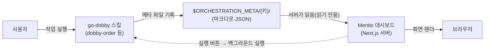
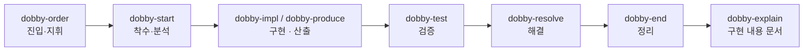

# Mentis Dashboard — 소개 (ABOUT)

> `go-dobby`(여러 에이전트로 이슈·작업을 자동 처리하는 오케스트레이션 플러그인)의 진행 상황을 눈으로 보기 위한 **로컬 대시보드**입니다.
> 이 문서는 "왜 만들었고, 어떻게 동작하며, 무엇을 할 수 있는지"를 코드를 모르는 사람도 이해할 수 있게 정리한 것입니다. (기준일: 2026-08-10)

---

## 1. 만들게 된 동기

한마디로, **"세션이 쌓이면 지난 작업을 다시 찾기 어렵고, 여러 에이전트가 지금 뭘 하는지 한눈에 안 보여서"** 만들었습니다.

- **지난 작업을 다시 찾는 게 불편했다.** go-dobby로 작업을 여러 건 돌리다 보면 대화 세션(터미널에서 진행한 한 번의 작업 흐름)이 계속 쌓입니다. 나중에 "그때 그 작업이 뭐였더라?"를 확인하려면 **옛 세션을 하나하나 열어 처음부터 읽어야** 했습니다. 이게 반복되니 번거로웠습니다.
- **에이전트 상태가 눈에 안 보였다.** 하나의 작업을 여러 에이전트가 나눠 동시에 진행하는데, **지금 누가 어떤 작업을, 어느 단계(분석·구현·리뷰·완료)에서 하고 있는지**를 터미널 로그만으로는 한눈에 파악하기 어려웠습니다. 이걸 **시각적으로 쉽게** 보고 싶었습니다.
- **그전에는 이렇게 했다.** 터미널 탭마다 이름을 손으로 적어 구분하고, 탭을 오가며 로그를 스크롤해 읽으며 확인했습니다. 놓치기 쉽고 손이 많이 갔습니다.
- **누구를 위한 것인가.** 팀 배포용이 아니라 **본인이 쓰려고 만든 개인 도구**입니다. 그래서 로컬(내 컴퓨터)에서만 도는 단순한 구조를 택했습니다.
- **재미 요소를 일부러 넣었다.** 에이전트들이 일하고 남기는 **"소감"(만족·불평·환호 같은 한마디)** 을 보고 싶었고, 반복 작업이 지루해서 **일하는 과정을 조금 재미있게** 만들고 싶었습니다. 그래서 아바타와 말풍선 소감 기능을 넣었습니다.

---

## 2. 아키텍처 설명

### 큰 그림 — "스킬은 파일을 쓰고, 대시보드는 그 파일을 읽는다"

- **기술 스택**: Next.js 14(App Router 방식) · React 18 · TypeScript · Ant Design v6(UI 컴포넌트 모음) · react-markdown(마크다운을 화면으로 그림).
- **데이터 저장소가 따로 없다.** 데이터베이스도, 외부 서버 API도 쓰지 않습니다. go-dobby 스킬이 작업 폴더 `$ORCHESTRATION_META/{키}/`에 쌓아둔 **파일(마크다운·JSON)** 을 대시보드 서버가 **직접 읽어** 화면으로 보여줍니다.
- **방향은 단방향이다.** 스킬이 "쓰고", 대시보드가 "읽습니다". 대시보드는 원칙적으로 메타를 **수정하지 않습니다**(예외: 아바타 소감 캐시, 해결 표시 버튼, 백업 같은 사용자 액션만).
- **"실행"은 별도 경로다.** 대시보드에서 작업을 시작·재개하는 버튼은, 서버의 API(`/api/orders`)가 **헤드리스(화면 없는) claude 프로세스**를 백그라운드로 띄워 처리하고 그 로그를 실시간으로 스트리밍합니다.

### 핵심 규약 (대시보드가 데이터를 이해하는 규칙)

- **오더(작업) 1건 = 폴더 1개**: `$ORCHESTRATION_META/{키}/`. 키는 Jira 이슈 키(`FE1-1187`) 또는 문서 전용 작업 키(`TASK-{slug}`).
- **목록에 뜨는 조건**: 그 폴더에 `status.md`(진행 인덱스) 또는 `orchestration.md`(관제탑)가 있으면 하나의 오더로 인식합니다.
- **상태 정본은 한 곳**: 에이전트별 상태는 `orchestration.md`의 상태표에서만 관리합니다(중복 방지).
- **파싱 계층**: `src/lib`의 `parseOrderStatus.ts`·`parseOrchestration.ts`·`transcript.ts` 등이 마크다운을 **정해진 규칙대로(결정적으로)** 읽어 필요한 값만 뽑습니다.

---

## 3. 동작 원리 및 대표 기능

### 작업 한 건이 거치는 흐름 (go-dobby 생명주기)

각 단계가 작업 폴더에 파일을 남기고, 대시보드는 그 파일을 읽어 해당 화면을 그립니다.

### 대표 기능

- **관제 보드**: 에이전트를 상태별 칸(대기 · 분석 · 구현 · 리뷰 · 완료)으로 나눈 칸반, 완료율, **정체 감지**(오래 멈춘 에이전트 경고), 이벤트 타임라인.
- **코드 변경 보기**: 에이전트별로 어떤 파일을 고쳤는지, 커밋과 변경 전→후 차이(diff)를, 실제 대화 로그를 근거로 보여줍니다.
- **콘솔**: 대시보드가 띄운 작업의 **실시간 진행 로그**와, 지난 **세션 전사(대화 기록)** 를 함께 봅니다.
- **구현 내용**: 코드를 모르는 사람도 이해할 수 있게 정리한 설명 + **흐름도(mermaid 다이어그램)**.
- **이어가기(세션 복귀)**: 작업했던 세션의 위치와 세션 ID로 `cd {경로} && claude --resume {세션ID}` 명령을 복사해 줍니다. **"지난 작업을 다시 찾기 어렵다"는 1번 동기를 직접 해결하는 기능**입니다.
- **실행 패널**: 대시보드에서 이슈 키·문서·요구사항을 입력하면 그 자리에서 `dobby-order`를 백그라운드로 실행합니다.
- **아바타·소감**: 에이전트마다 아바타(방탄소년단·프로미스나인·아이브·도비)를 배정하고, 상태에 따라 한마디 소감을 남깁니다(재미 요소).
- **백업**: Claude 세션 기록 폴더(`~/.claude/projects`)를 증분 압축으로 백업합니다.

---

## 4. 주요 관련 스킬과 하는 일 (요점만)

모든 작업은 **`dobby-order` 하나로 시작**합니다. 나머지는 그 안에서 불려 쓰이는 조립 부품(building block)입니다.

| 스킬 | 한 줄 요약 |
|---|---|
| **dobby-order** | 유일한 진입점. 작업을 받아 **몇 명의 에이전트로 나눌지(팬아웃 K)** 정하고 착수·구현·리뷰·통합을 지휘 |
| **dobby-start** | 각 에이전트의 착수·분석. 전용 작업 폴더(워크트리)와 브랜치를 만들고 분석·테스트 계획을 남김 |
| **dobby-impl** | 코드 구현(서브 에이전트). 계약에서 허용한 파일 범위 안에서만 수정 |
| **dobby-produce** | 코드가 아닌 산출물(문서·조사·분석) 작성 |
| **dobby-test** | 실제 브라우저로 동작 검증(국내/글로벌 전환·로그인 포함) |
| **dobby-resolve** | 작업을 "해결" 상태로 표시(비파괴) |
| **dobby-end** | 다 끝난 작업의 작업 폴더(워크트리)를 안전하게 정리 |
| **dobby-explain** | 비개발자용 "구현 내용" 문서 생성(+흐름도) |
| **dobby-retro** | 재작업·불일치 원인을 정리한 회고 문서 생성 |
| **dobby-jira-tab** | Jira 이슈 원문 정리·업데이트 요약·게시 |
| **dobby-share** | "구현 내용"을 공개 아티팩트로 게시 |
| **dobby-qa** | 통합 후 Jira를 주기적으로 확인해 편입된 버그를 담당 에이전트가 수정 |
| **dobby-init** | 환경 설정 파일(`config.env`)을 만드는 유일한 스킬 |
| **avatar-quips** | 아바타 소감 생성(재미 요소, 대시보드가 백그라운드로만 호출) |
| **dobby-migrate** | 옛 v1(work-dobby) 메타를 v2(go-dobby) 형식으로 변환 |

---

## 5. 페이지와 기능 설명

| 경로 | 이름 | 무엇을 보여주나 |
|---|---|---|
| `/` | 홈(허브) | 작업을 **개발 · 비개발** 두 묶음으로 나눠 개수·진행중·리뷰중·완료 지표. 마지막 백업 날짜·백업 버튼 |
| `/orchestration` | 오케스트레이션 목록 | 오더 목록(키·실행 모드·에이전트 수·상태 분포·진행률) + 상단 **실행 패널** + **검색(에픽/제목)·필터(작업 상태)** |
| `/orchestration/[key]` | 관제 보드 | 에이전트 칸반·완료율·정체 감지·이벤트 타임라인 + 계약·분석·구현/산출·산출물 요약 |
| `/orchestration/[key]/changes` | 코드 변경 | 에이전트별 수정 파일·커밋·변경 전→후 차이. 상단 에이전트 이동 바 |
| `/orchestration/[key]/explain` | 구현 내용 | 비개발자용 설명 + 흐름도. "작업 내용 정리" 오더에서는 **작업 내용** 탭으로 표시 |
| `/orchestration/[key]/verify` | 검증 | 브라우저 검증 결과(회차별) + 사용자 수동 확인 가이드 |
| `/orchestration/[key]/jira` | Jira | 저장된 Jira 이슈 원문·정리본·코멘트 요약·업데이트 요약(있을 때만 노출) |
| `/orchestration/[key]/artifact` | 아티팩트 | 구현 내용의 공개 링크·로컬 미리보기(LAN 주소로 제공) |
| `/orchestration/[key]/retro` | 회고 | 재작업·불일치 원인 정리와 개선 제안 |
| `/orchestration/console/[key]` | 콘솔 | 실시간 실행 로그 + 세션 전사(오케스트레이터·서브 에이전트) |
| `/agents` | 에이전트 소개 | 도비 에이전트 소개 |
| `/avatars` | 아바타 | 그룹별 아바타 전체 보기 |
| `/map` | 구성도 | 어떤 스킬이 만든 파일이 어느 화면에 보이는지 정리(파이프라인·표) |
| `/backup` | 백업 | 백업 파일 목록·통계·기록, "지금 백업" 버튼 |

- **자동 갱신**: 모든 페이지는 30초마다 서버 데이터만 다시 읽어 최신화합니다(전체 새로고침 아님).
- **탭 구성 분기**: 오더 종류에 따라 상세 탭이 달라집니다. 예를 들어 "작업 내용 정리" 오더는 **작업 내용·콘솔·아티팩트·회고** 4개만, Jira가 없는 `TASK-` 오더는 Jira/PR 버튼을 숨깁니다.

---

## 6. 장점과 단점

### 대시보드
**장점**
- **의존성이 거의 없다.** 데이터베이스·외부 서버 없이 파일만 읽어, 설치·운영이 단순하고 오프라인에서도 동작.
- **실시간 가시성.** 여러 에이전트의 상태·진행을 한 화면에서 시각적으로 파악(1·2번 동기 해결).
- **세션 복귀.** 지난 작업 세션으로 바로 돌아가는 명령을 제공.
- **읽기 전용이라 안전.** 조회가 스킬의 작업 데이터를 망가뜨리지 않음.

**단점**
- **로컬 전용·인증 없음.** 헤드리스 claude를 권한 우회 모드로 실행하므로 **신뢰된 개인 환경에서만** 써야 함(팀 공개용 아님).
- **파일 규약에 강하게 묶임.** 스킬이 정해진 형식(상태값·표 형식 등)을 어기면 해당 항목이 화면에서 **조용히 비어** 보일 수 있음.
- **단일 사용자 전제.** 동시 편집·다중 사용자 시나리오는 고려하지 않음.

### 스킬(go-dobby)
**장점**
- **단일 진입점.** 모든 작업을 `dobby-order` 하나로 시작해 흐름이 일관됨.
- **자동 분해·격리.** 작업 범위를 보고 에이전트 수를 정하고, 에이전트별 계약(수정 허용 범위)과 별도 작업 폴더로 **병렬 충돌을 예방**.
- **토큰 절약형 기록.** 상태 파일을 작게 유지하고 덧붙이기(append) 위주로 갱신.

**단점**
- **규칙이 많고 복잡.** 지켜야 할 형식·게이트가 많아 학습 곡선이 있음.
- **형식 의존.** 마크다운 형식·상태값 표기를 정확히 지켜야 대시보드와 맞물림.
- **권한 부담.** 자동 실행이 강한 권한으로 도므로 환경 신뢰가 전제.

---

## 7. 성능 최적화 (속도·토큰 관점)

### 토큰(대화 비용) 절약
- **상태 파일을 작게 유지.** `status.md`는 현재 상태 인덱스로만 두고, 무거운 내용(분석·구현 요약·로그)은 별도 파일로 분리. 갱신은 전체를 다시 읽지 않고 **덧붙이기/부분 수정**(헬퍼 함수)으로 처리.
- **문서 생성은 델타(변경분)만.** 구현 내용(explainer)·회고(retro)는 기본적으로 **새로 늘어난 부분만 덧붙이고**, 전체 재생성은 명시할 때만.
- **재미 기능은 가볍게.** 아바타 소감(avatar-quips)은 무거운 본문·로그를 읽지 않고 **상태·라운드·역할 같은 가벼운 신호만** 읽어 빠르고 토큰이 적음.
- **리뷰는 순차 처리.** 리뷰어가 "먼저 끝난 구현부터" 처리하고 그 변경은 잊어, 한 번에 들고 있는 컨텍스트를 작게 유지.

### 속도
- **파일 읽기 기반.** 서버가 파일시스템을 직접 읽어 응답이 빠르고, 파싱도 정해진 규칙으로 필요한 값만 추출.
- **자동 갱신은 데이터만.** 30초 주기 갱신은 서버 데이터만 다시 읽고 전체 페이지를 새로 그리지 않음.
- **세션 전사 재사용.** 코드 변경·콘솔은 이미 있는 세션 기록을 재사용해 별도 수집 비용을 줄임.
- **격리 개발 빌드.** 개발 중에는 별도 빌드 폴더(`.next-dev7254`)로 띄워 사용자가 쓰는 운영 빌드를 건드리지 않음.
- **백업은 증분.** 마지막 백업 파일 이름의 시각을 기준으로 그 이후 것만 압축해 저장.

### 병렬성
- **에이전트별 작업 폴더(워크트리) 격리.** 각 에이전트가 자기 폴더·브랜치에서 작업해 파일 충돌 없이 **동시에 진행**할 수 있음.

---

> 이 문서는 초안(1~7번)입니다. 이후 배포·확장·상세 설계 등 항목을 필요에 따라 덧붙일 수 있습니다.
